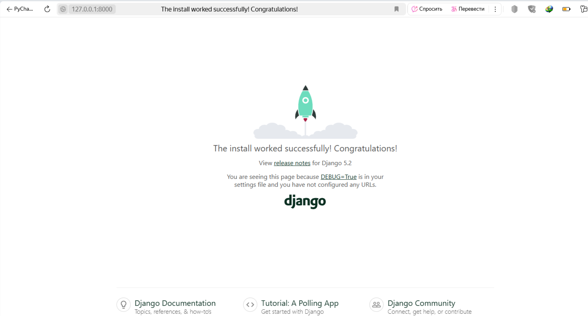
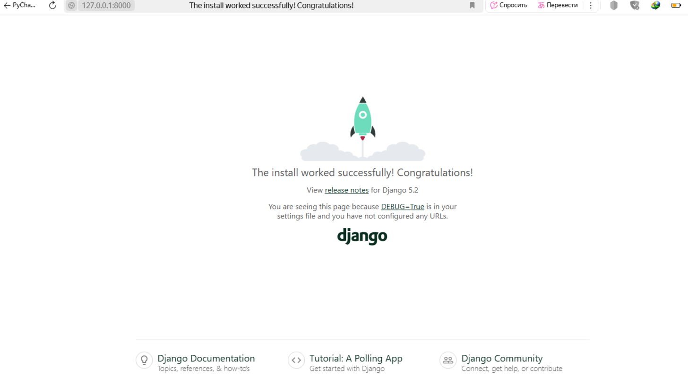
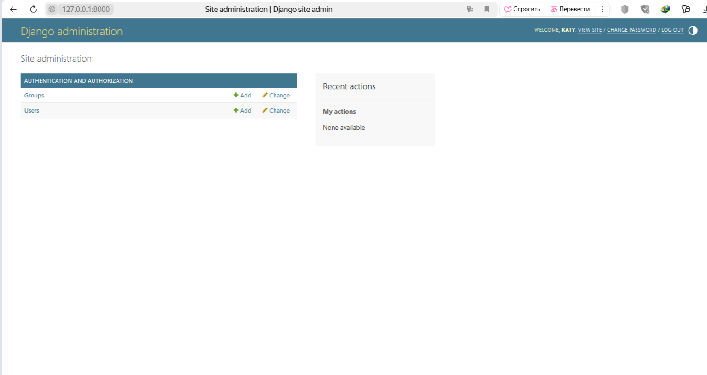
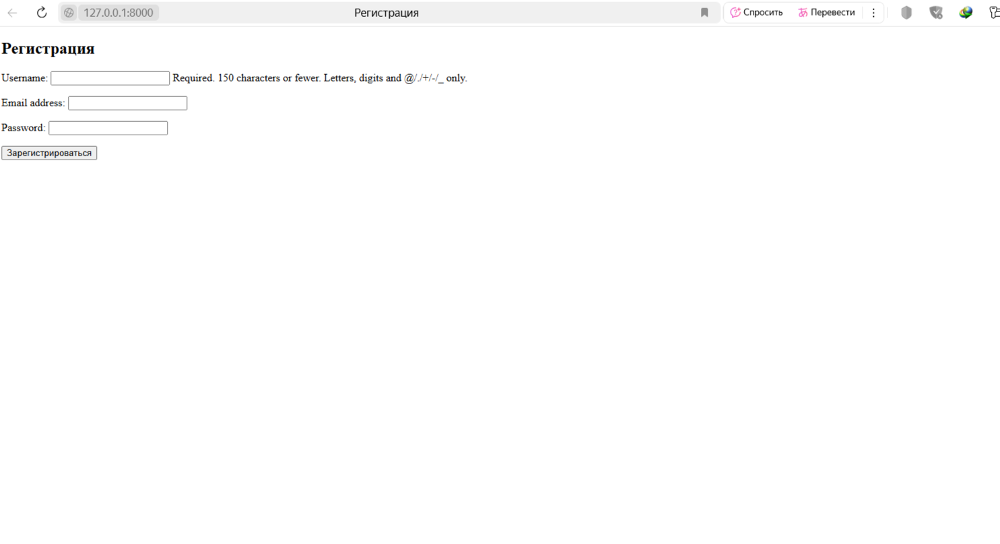
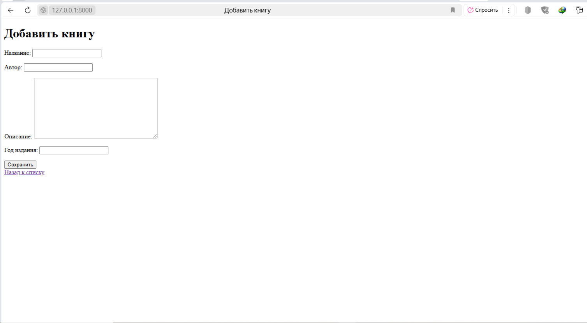
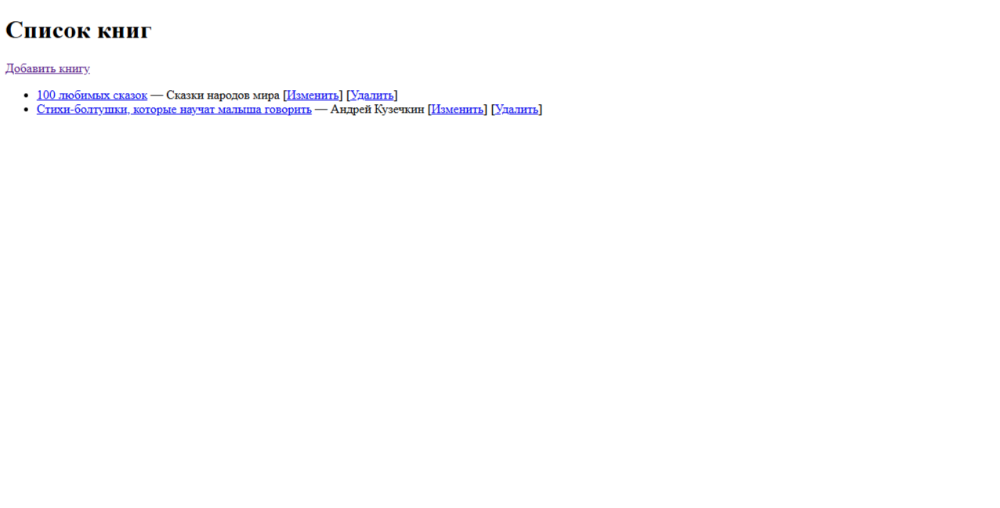
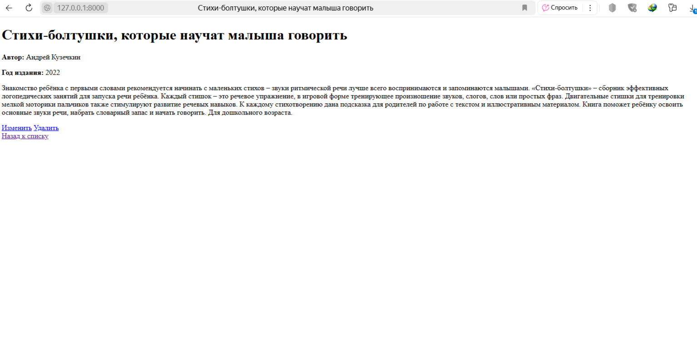
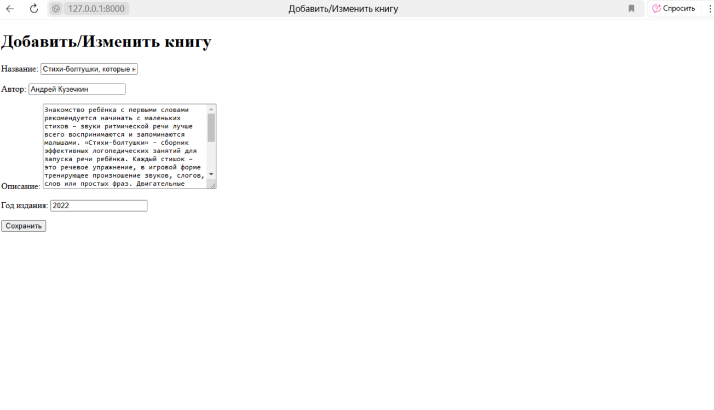
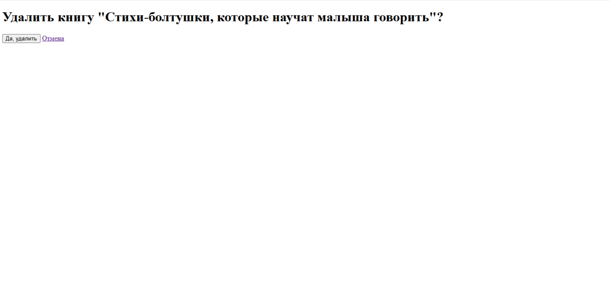
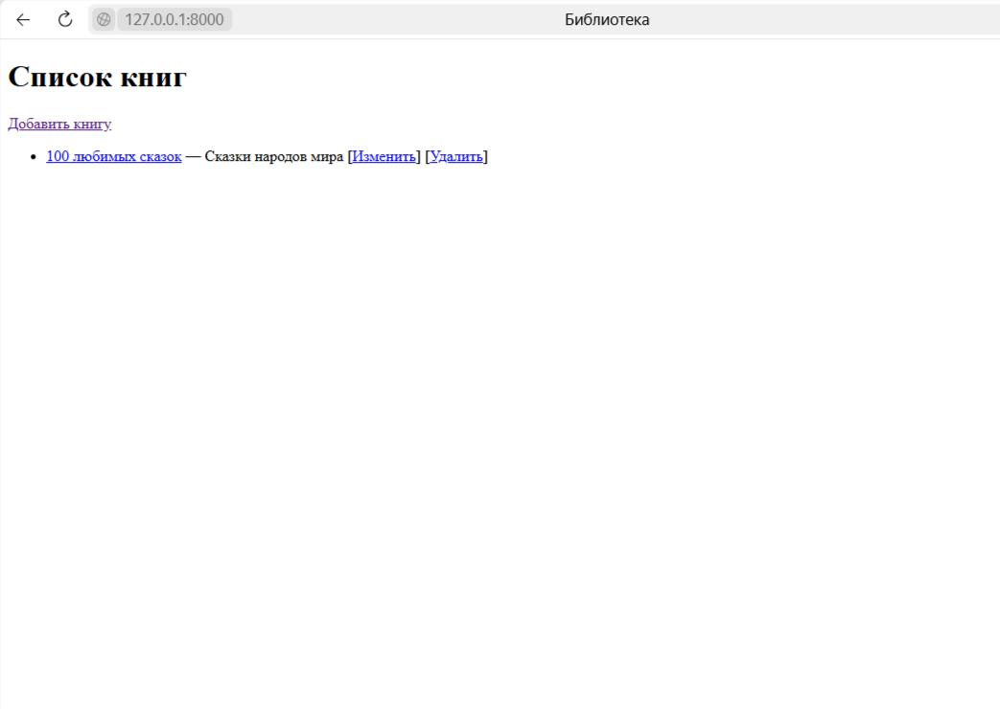

###Задание:

Написать простой сайт библиотеку, с возможностью загружать, удалять, 
изменять книги. На главной необходимо выводить весь список книг, 
при клике на название книги должен быть переход, на детальное описание книги. 

Css для оформления сайта можно не использовать

Изменение

Удаление

После удаления

